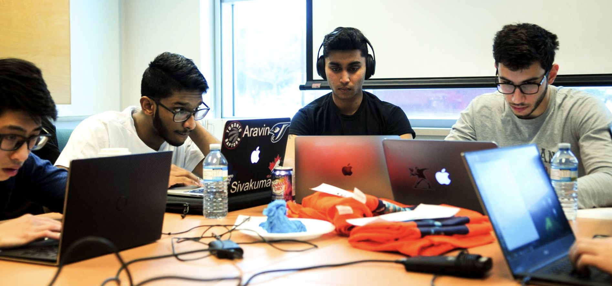

# McMaster Programming Challenge 2018

A programming challenge hosted by the McMaster Student branch of the IEEE (Institute for Electrical and Electronics Engineers)

## Completed Using

* [HackerRank](https://www.hackerrank.com/)
* Python

## Pictures

## Authors

* **Ahmed Fuad Ali**
* **Daniel Jabbour**

